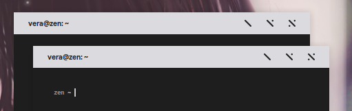
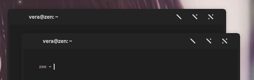

## Avrora
As you can see, There is 4-variant of this theme

##### Avrora : theme with bright title bar


##### Avrora-Dark : theme with dark title bar


##### Avrora-Ein : theme with bright title bar, thick border and rounded corner


##### Avrora-Ein-Dark : theme with dark title bar, thick border and rounded corner


## Installation
- just copy to the .themes folder and you're ready to use that

## Editing title colors
run update color like this on the xfwm theme folder (~/.themes/Avrora/xfwm4/):
```
sh colorize.sh bgcolor fgcolor
```
example :
```
sh colorize.sh 112233 ffffff
```
or :
```
sh colorize.sh #112233 #ffffff
```
